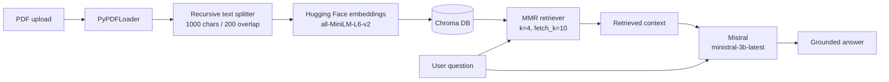
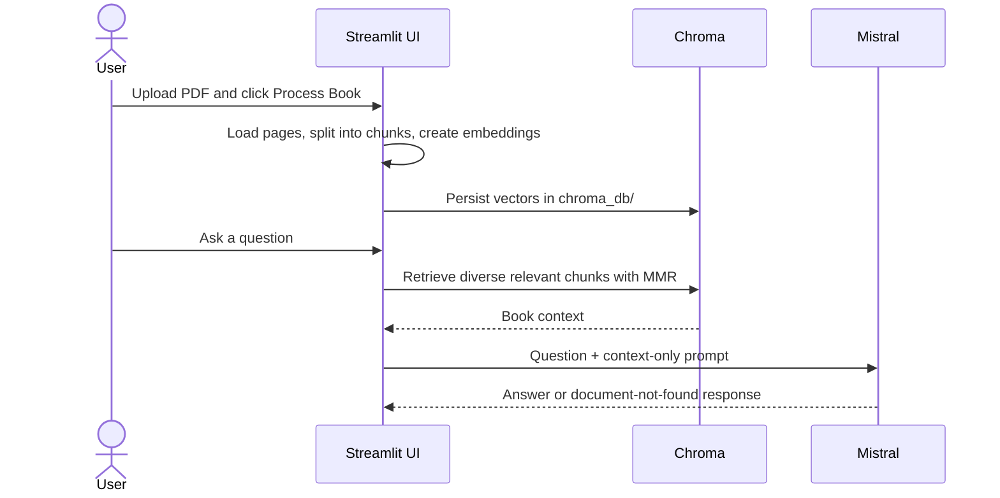
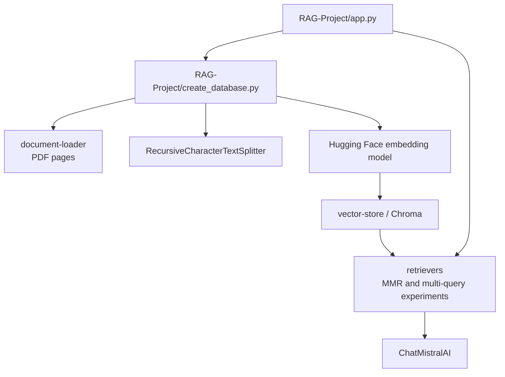

# Generative AI Experiments

A hands-on collection of LangChain experiments: hosted and local models, embeddings, structured extraction, and Streamlit apps. The newest workflow is a book question-answering assistant that turns an uploaded PDF into a searchable local knowledge base.

<p align="center">
	<strong>Upload PDF</strong> &rarr; <strong>Chunk + embed</strong> &rarr; <strong>Search with MMR</strong> &rarr; <strong>Answer from the book</strong>
</p>

## Explore the workflows

<details open>
<summary><strong>Book RAG Assistant</strong></summary>

Upload a PDF in Streamlit, process it into a Chroma vector store, and ask questions about its contents. The assistant is instructed to use only retrieved book context and to say when the answer is not present.





Run it from the repository root:

```powershell
streamlit run RAG-Project/app.py
```

</details>

<details>
<summary><strong>Other Streamlit apps and examples</strong></summary>

| Experience | Start command | What it demonstrates |
| --- | --- | --- |
| CineSage | `streamlit run CineSage/UICore.py` | Extract movie details into a validated Pydantic schema |
| Mode-based chatbot | `streamlit run chatbot/chatbot.py` | Stateful chat with angry, funny, or sad response modes |
| Chat model examples | See commands below | Mistral, Gemini, Hugging Face, and local Hugging Face pipelines |
| Embedding examples | See commands below | Gemini and Hugging Face embeddings |

</details>

## Requirements

- Python 3.10 or newer
- API credentials for the provider used by the example you want to run
- A working C++ build toolchain may be required by some local Hugging Face dependencies.

## Setup

Create and activate a virtual environment:

```powershell
python -m venv .venv
.\.venv\Scripts\Activate.ps1
```

Install dependencies:

```powershell
pip install -r requirements.txt
```

Create a local environment file from the template and add your own credentials:

```powershell
Copy-Item .env.examples .env
```

`.env` is ignored by Git. Never commit real API keys or tokens.

The RAG app and the Streamlit demos use `MISTRAL_API_KEY`. The first RAG run also downloads the `all-MiniLM-L6-v2` embedding model. Processing a new book replaces the previous local Chroma database and clears the current chat.

## Run the applications

Launch the movie information extractor:

```powershell
streamlit run CineSage/UICore.py
```

Launch the mode-based chatbot:

```powershell
streamlit run chatbot/chatbot.py
```

Launch the book RAG assistant:

```powershell
streamlit run RAG-Project/app.py
```

## Project layout

```text
chatbot/             Streamlit conversational agent
chatmodels/          Hosted and local chat model examples
CineSage/            Movie information extraction app and core logic
embeddingmodels/     Embedding model examples
RAG-Project/         PDF ingestion, RAG app, retrievers, and vector-store code
uploaded_books/      Local PDFs uploaded to the RAG app (ignored)
chroma_db/           Local Chroma persistence generated by the RAG app (ignored)
requirements.txt     Python dependencies
.env.examples        Environment variable template
```

The RAG internals are split into focused stages:



## Environment variables

Set only the credentials required by the example you are running:

| Variable | Used by |
| --- | --- |
| `MISTRAL_API_KEY` | CineSage, chatbot, and Book RAG Assistant |
| `GOOGLE_API_KEY` | Gemini chat and embedding examples |
| `HUGGINGFACEHUB_API_TOKEN` | Hugging Face hosted model example |

<details>
<summary><strong>Run the standalone examples</strong></summary>

```powershell
python chatmodels/chat.py
python chatmodels/huggingface.py
python chatmodels/localmodel.py
python embeddingmodels/embedding.py
python embeddingmodels/huggingface_embedding.py
python CineSage/core.py
```

The local model example downloads model files on its first run and can require substantial disk space and memory.

</details>
